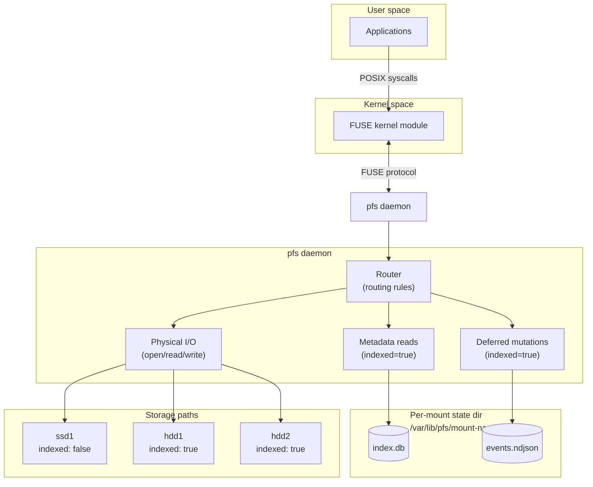

# Core Concepts

PolicyFS presents a single FUSE mountpoint over multiple physical storage paths.
Routing rules control which storage handles reads and writes for each virtual path.
An optional SQLite index lets metadata operations skip spinning disks entirely.

A single config file (`/etc/pfs/pfs.yaml`) can define **multiple mounts**, each with its own storage paths, routing rules, and maintenance jobs. Each mount runs as an independent daemon with its own systemd service.

## Three things to know before you configure

- **Storage path** - a physical directory on one of your disks (e.g. `/mnt/hdd1/media`). You list these under `storage_paths`. Setting `indexed: true` on a path means PolicyFS will serve its metadata from a local SQLite database - so directory listings and stat calls don't spin up the disk.

- **Routing rule** - maps a glob pattern (e.g. `library/**`) to which storage paths handle reads and writes for matching virtual paths. Rules are evaluated top-to-bottom, first match wins. Every config must end with a catch-all rule (`**`).

- **Maintenance cycle** - three scheduled jobs (`pfs move`, `pfs prune`, `pfs index`) that run on a schedule (typically nightly) to tier files to archive disks, apply deferred changes, and refresh the index. Run as a single `pfs maint` command or via the `pfs-maint@<mount>.timer` systemd unit.

See [Use cases](use-cases.md) to see these concepts in action before reading the full reference below.

## Architecture



PolicyFS sits between applications and your physical storage.

At a high level:

- Applications do normal POSIX syscalls on the mountpoint.
- The kernel forwards them over FUSE to the `pfs` daemon.
- The daemon routes each path to one or more storage paths.
- Some storages can be `indexed: true`, which enables metadata reads from SQLite and deferred mutations via an event log.

!!! warning "Not for application state"
PolicyFS is optimized for media libraries and other mostly-static files.
For unsupported workloads and limitations, see [How pfs works](how-it-works.md#not-a-good-fit-for).

| Daemon component            | Responsibility                                               | Why it exists                                           |
| --------------------------- | ------------------------------------------------------------ | ------------------------------------------------------- |
| Router (routing rules)      | Resolve `read_targets` / `write_targets` for a virtual path. | Makes placement and shadowing explicit and predictable. |
| Direct filesystem access    | Read/write physical files for `indexed: false` storages.     | Boring fast path for SSDs and non-indexed disks.        |
| SQLite index (`index.db`)   | Serve metadata reads for `indexed: true` storages.           | Avoids spinning up HDDs for metadata-heavy workloads.   |
| Event log (`events.ndjson`) | Record deferred metadata mutations on indexed storages.      | Lets deletes/renames/chmod happen without waking disks. |

The FUSE daemon handles the hot path (routing reads/writes and recording deferred operations).
Maintenance jobs are run as CLI subcommands (typically via systemd timers).

## How reads work

When an application reads a file through the mount, the daemon resolves `read_targets` for that virtual path and tries each storage in config order:

1. Match the routing rule and resolve `read_targets`.
2. Try each target in order:
   - If the target storage is **non-indexed**, check the physical filesystem.
   - If the target storage is **indexed**, query SQLite for metadata (disk stays asleep).
3. The first hit wins: open the physical file and return a handle.

- **Non-indexed storage**: the daemon checks the physical filesystem directly.
- **Indexed storage**: the daemon queries the SQLite index for metadata (size, mtime, mode). The physical disk is not touched until the application actually reads file data bytes.
- Once a file handle is opened, all subsequent read/write I/O goes directly to the physical file via a cached file descriptor.

## How writes work

When an application creates a new file, the daemon picks a single write target through a pipeline:

1. Match the routing rule and resolve `write_targets`.
2. Apply `path_preserving` (prefer targets where the parent dir already exists).
3. Apply `min_free_gb` filtering.
4. Select a single target via `write_policy`.
5. Create the file on the chosen physical target.

### Immediate vs deferred operations

Not all filesystem operations reach the physical disk immediately. The behavior depends on whether the target storage is indexed:

- **Non-indexed storage:** apply the physical operation immediately.
- **Indexed storage:** apply metadata changes to the index and append an event for later physical application by `pfs prune`.

| Operation                       | Non-indexed          | Indexed                                      |
| ------------------------------- | -------------------- | -------------------------------------------- |
| Create, Mkdir, Write            | Physical immediately | Physical immediately                         |
| Delete (unlink/rmdir)           | Physical immediately | Mark deleted in index + append DELETE event  |
| Rename                          | Physical immediately | Update index + append RENAME event           |
| Setattr (chmod, chown, utimens) | Physical immediately | Update index metadata + append SETATTR event |

File creation and data writes always go to the physical disk - the deferred path only applies to metadata mutations (delete, rename, setattr). This means an indexed HDD only needs to spin up when new files are written to it, not when existing files are deleted or renamed.

## Disk spindown (power saving)

PolicyFS can reduce disk wake-ups caused by metadata operations by using `indexed: true`, but it does not control drive power states.
To actually spin down HDDs and save power, configure OS-level disk power management (for example `hd-idle`).

See [Disk spindown (power saving)](spindown.md).

## The maintenance cycle

PolicyFS relies on three maintenance jobs: `pfs move`, `pfs prune`, and `pfs index`.

See [How pfs works](how-it-works.md#maintenance-cycle) for the sequence and what each job does.

Command references:

- [`pfs maint`](commands/maint.md)
- [`pfs move`](commands/move.md)
- [`pfs prune`](commands/prune.md)
- [`pfs index`](commands/index.md)

## Daemon and maintenance coordination

The daemon and maintenance jobs run as separate processes. They coordinate through locks, a control socket, and shared files:

| Mechanism         | How it works                                                                                                                                                                                                                                   |
| ----------------- | ---------------------------------------------------------------------------------------------------------------------------------------------------------------------------------------------------------------------------------------------- |
| `daemon.sock`     | The daemon exposes open file counts and accepts `pfs reload <mount>` requests via a control socket. The mover queries it to skip files currently being read or written. If the socket is unavailable, the mover proceeds anyway (best-effort). |
| Event log locking | The daemon appends events under a shared lock (`LOCK_SH`). Prune truncates under an exclusive lock (`LOCK_EX`) to avoid the race where truncation drops freshly-appended events.                                                               |
| SQLite index      | The daemon reads from the index. The indexer writes to it. SQLite WAL mode allows concurrent readers with a single writer.                                                                                                                     |

## Storage paths

A storage path is a physical directory root.
Each storage path has:

| Field         | Description                                                                                                                                  |
| ------------- | -------------------------------------------------------------------------------------------------------------------------------------------- |
| `id`          | Stable identifier used in config, logs, and the index database.                                                                              |
| `path`        | Absolute filesystem path (e.g. `/mnt/hdd1/media`).                                                                                           |
| `indexed`     | When `true`, metadata is served from the SQLite index instead of the physical disk. Mutations are deferred and applied later by `pfs prune`. |
| `min_free_gb` | Minimum free space (GiB) required before PolicyFS will write new files to this storage.                                                      |

## Storage groups

A storage group is a named list of storage path IDs.
Groups simplify routing rules and mover configuration - you can reference `ssds` instead of listing `ssd1, ssd2` everywhere.

```yaml
storage_groups:
  ssds: [ssd1, ssd2]
  hdds: [hdd1, hdd2, hdd3]
```

Groups are expanded when routing rules and mover jobs are evaluated.

## Routing rules

Routing rules map virtual paths to storage targets. Rules are evaluated **top-to-bottom, first match wins**.

A rule defines:

| Field             | Description                                                                  |
| ----------------- | ---------------------------------------------------------------------------- |
| `match`           | Glob pattern matched against the virtual path. `**` matches any depth.       |
| `read_targets`    | Storage IDs or group names used for reads and directory listings.            |
| `write_targets`   | Storage IDs or group names used for writes (create, link, rename).           |
| `write_policy`    | How to pick one write target from the candidates - see below.                |
| `path_preserving` | When `true`, prefer write targets where the parent directory already exists. |

Shorthand: `targets` sets both `read_targets` and `write_targets` at once.

!!! warning "Catch-all rule required"
The last routing rule **must** be the catch-all pattern `**`. PolicyFS rejects configs without it.

### Write policies

When a write operation needs a single target, the write policy selects one from the resolved candidates (after `min_free_gb` filtering):

| Policy        | Behavior                                                              |
| ------------- | --------------------------------------------------------------------- |
| `first_found` | Use the first eligible target in list order. This is the **default**. |
| `most_free`   | Use the target with the most free space.                              |
| `least_free`  | Use the target with the least free space.                             |

### Path-preserving writes

When `path_preserving: true`, PolicyFS prefers targets where the parent directory of the new file already exists on disk.
If no target has the parent directory, all candidates remain eligible and the write policy decides.

This keeps related files together - for example, all files in `library/movies/MovieA/` will land on the same disk.

**Example:** You have `hdd1` and `hdd2`. Jellyfin downloads a movie and creates `library/movies/Inception/` on `hdd1`. Later, a subtitle file arrives for the same movie. With `path_preserving: true`, PolicyFS writes `library/movies/Inception/Inception.en.srt` to `hdd1` - because the parent directory already exists there - rather than scattering it to `hdd2`.

## Directory listings

Unlike reads and writes (first match wins), directory listings consider **all** routing rules whose pattern could match descendants of the listed directory.
The result is the union of entries across all matching storage targets, deduplicated by name.

## Locks

PolicyFS uses file locks to prevent conflicts:

| Lock          | Location                  | Purpose                                                                                |
| ------------- | ------------------------- | -------------------------------------------------------------------------------------- |
| `daemon.lock` | `/run/pfs/<mount>/locks/` | Ensures only one FUSE daemon runs per mount.                                           |
| `job.lock`    | `/run/pfs/<mount>/locks/` | Ensures only one maintenance job (index, move, prune, maint) runs at a time per mount. |

If a lock is already held, the command exits with code **75** (busy).

## State and runtime directories

| Directory | Default                 | Contents                                            |
| --------- | ----------------------- | --------------------------------------------------- |
| Config    | `/etc/pfs/pfs.yaml`     | Main configuration file.                            |
| State     | `/var/lib/pfs/<mount>/` | Persistent data: SQLite index database, event logs. |
| Runtime   | `/run/pfs/<mount>/`     | Ephemeral data: lock files, daemon control socket.  |

## Use cases

See [Use cases](use-cases.md).
